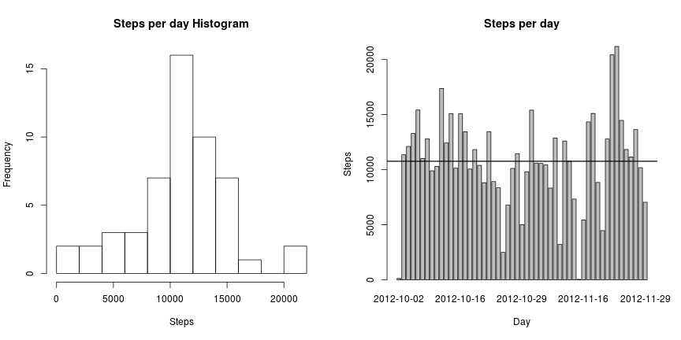
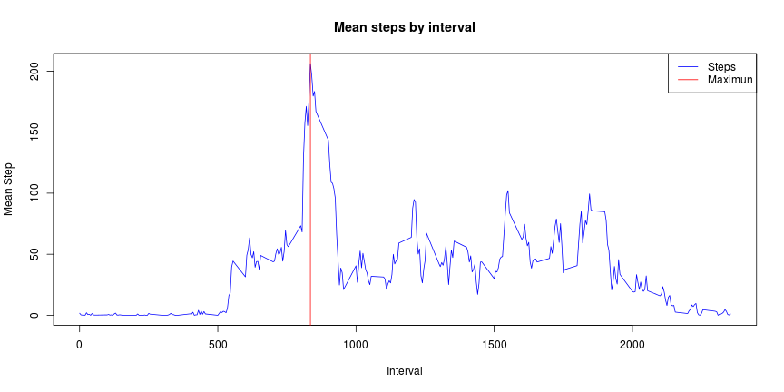
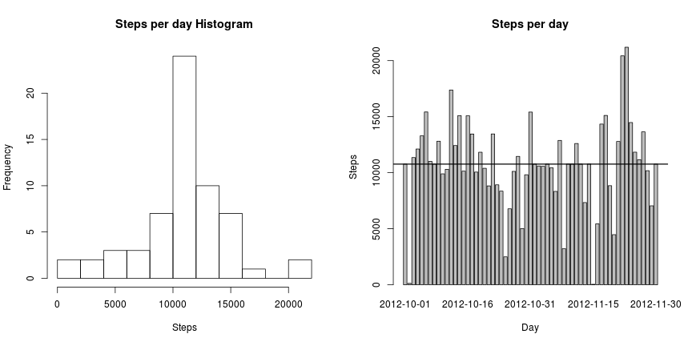
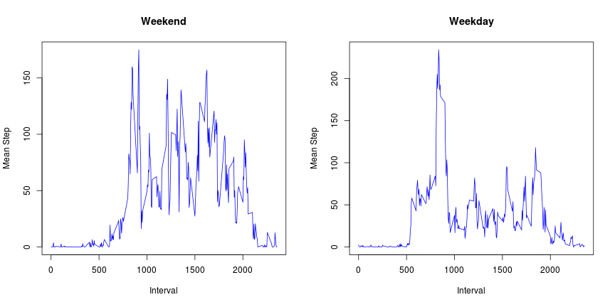

# Reproducible Research: Peer Assessment 1


## Loading and preprocessing the data

```r
# Load the data with their associated column type
data <- read.csv("activity.csv", header = TRUE, colClasses = c("numeric", "Date", 
    "factor"), stringsAsFactors = FALSE)
str(data)
```

```
'data.frame':	17568 obs. of  3 variables:
 $ steps   : num  NA NA NA NA NA NA NA NA NA NA ...
 $ date    : Date, format: "2012-10-01" "2012-10-01" ...
 $ interval: Factor w/ 288 levels "0","10","100",..: 1 226 2 73 136 195 198 209 212 223 ...
```

```r
summary(data)
```

```
     steps            date               interval    
 Min.   :  0.0   Min.   :2012-10-01   0      :   61  
 1st Qu.:  0.0   1st Qu.:2012-10-16   10     :   61  
 Median :  0.0   Median :2012-10-31   100    :   61  
 Mean   : 37.4   Mean   :2012-10-31   1000   :   61  
 3rd Qu.: 12.0   3rd Qu.:2012-11-15   1005   :   61  
 Max.   :806.0   Max.   :2012-11-30   1010   :   61  
 NA's   :2304                         (Other):17202  
```


## What is mean total number of steps taken per day?

```r
# Clean NA rows
dataClean <- data[!is.na(data$steps), ]

# Returns data aggregated by date
stepsByDay <- function(stepData) {
    tData <- aggregate(stepData$steps, by = list(stepData$date), sum, na.rm = TRUE)
    colnames(tData) <- c("date", "steps")
    tData
}

tData <- stepsByDay(dataClean)
head(tData)
```

```
        date steps
1 2012-10-02   126
2 2012-10-03 11352
3 2012-10-04 12116
4 2012-10-05 13294
5 2012-10-06 15420
6 2012-10-07 11015
```

```r

meanStepsByDay <- mean(tData$steps)
medianStepsByDay <- median(tData$steps)
```

The **mean** number of steps taken per day are; 10766.1887  
The **median** number of steps taken per day are; 10765

In a graph:


```r

plotData <- function(stepData) {
    par(mfrow = c(1, 2))
    hist(stepData$steps, xlab = "Steps", main = "Steps per day Histogram", breaks = 10)
    barplot.default(stepData$steps, names.arg = stepData$date, main = "Steps per day", 
        ylab = "Steps", xlab = "Day")
    abline(h = meanStepsByDay)
    abline(h = medianStepsByDay)
}

plotData(tData)
```

 


## What is the average daily activity pattern?

```r
tData <- aggregate(list(`Steps Mean` = dataClean$steps), by = list(interval = dataClean$interval), 
    mean)

# Convert to numeric and sort it for plotting
tData$interval <- as.integer(levels(tData$interval))
tData <- tData[order(tData$interval), ]

max <- tData[which.max(tData$Steps.Mean), ]

plot(tData$interval, tData$Steps.Mean, type = "l", xlab = "Interval", ylab = "Mean Step", 
    main = "Mean steps by interval", col = "blue")
abline(v = max[1, "interval"], col = "red")
legend("topright", c("Steps", "Maximun"), lty = c(1, 1), col = c("blue", "red"))
```

 

The maximun activity happens in interval **835** with **206.1698 steps**

## Imputing missing values

```r
# Vector with indexes for rows with NA. NA are only in 'steps'
na_idx <- which(is.na(data$steps))
# Calculation of replacement values to substitute NA values.
na_replacements <- unlist(lapply(na_idx, FUN = function(idx) {
    interval = data[idx, ]$interval
    tData[tData$interval == interval, ]$Steps.Mean
}))


tData <- data
# NA substitution
tData$steps[na_idx] <- na_replacements

summary(tData)
```

```
     steps            date               interval    
 Min.   :  0.0   Min.   :2012-10-01   0      :   61  
 1st Qu.:  0.0   1st Qu.:2012-10-16   10     :   61  
 Median :  0.0   Median :2012-10-31   100    :   61  
 Mean   : 37.4   Mean   :2012-10-31   1000   :   61  
 3rd Qu.: 27.0   3rd Qu.:2012-11-15   1005   :   61  
 Max.   :806.0   Max.   :2012-11-30   1010   :   61  
                                      (Other):17202  
```

```r

tData <- stepsByDay(tData)
plotData(tData)
```

 

```r

meanStepsByDayRep <- mean(tData$steps)
medianStepsByDayRep <- median(tData$steps)
```


The **mean** number of steps taken per day are; 10766.1887  
The **median** number of steps taken per day are; 10766.1887

In a graph:


```r
plotData(tData)
```

 


```r
tData <- data.frame(Original = c(meanStepsByDay, medianStepsByDay), Replaced = c(meanStepsByDayRep, 
    medianStepsByDayRep))
tData$Original <- format(tData$Original, , nsmall = 3)
tData$Replaced <- format(tData$Replaced, , nsmall = 3)
rownames(tData) <- c("mean", "median")
tData
```

```
        Original  Replaced
mean   10766.189 10766.189
median 10765.000 10766.189
```

So, updating NA values with the interval median steps keep main unchanged while increasing the median to be equal to the mean.

## Are there differences in activity patterns between weekdays and weekends?


```r
tData2 <- dataClean
# Add a column for the weekday
tData2$weekday <- as.factor(weekdays(tData2$date))

weekend <- subset(tData2, weekday %in% c("Saturday", "Sunday"))
weekday <- subset(tData2, !weekday %in% c("Saturday", "Sunday"))

weekend_spi <- aggregate(list(`Steps Mean` = weekend$steps), by = list(interval = weekend$interval), 
    mean, na.rm = TRUE)
weekday_spi <- aggregate(list(`Steps Mean` = weekday$steps), by = list(interval = weekday$interval), 
    mean, na.rm = TRUE)

weekend_spi$interval <- as.integer(levels(weekend_spi$interval))
weekday_spi$interval <- as.integer(levels(weekday_spi$interval))

weekend_spi <- weekend_spi[order(weekend_spi$interval), ]
weekday_spi <- weekday_spi[order(weekday_spi$interval), ]

par(mfrow = c(1, 2))
plot(weekend_spi$interval, weekend_spi$Steps.Mean, type = "l", xlab = "Interval", 
    ylab = "Mean Step", main = "Weekend", col = "blue")
plot(weekday_spi$interval, weekday_spi$Steps.Mean, type = "l", xlab = "Interval", 
    ylab = "Mean Step", main = "Weekday", col = "blue")
```

 

As we can see in the figures, the activity is greater in weekends going on through most of the day intervals.
